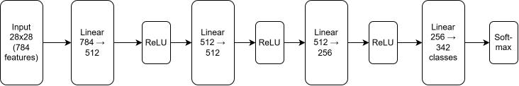
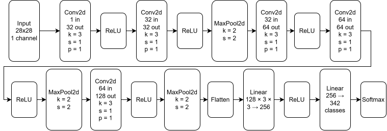
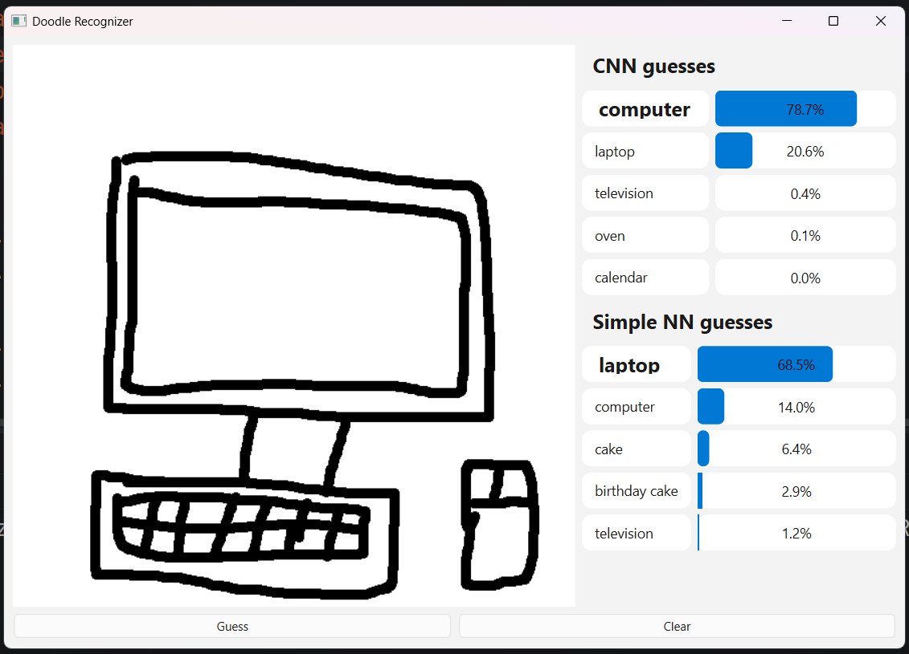

# DoodleRecognizer

This project compares how well a homemade convolutional neural network
can recognize doodles to how well a homemade basic/simple neural network
can do the same. I built both implementations myself from scratch using
conceptual help from ChatGPT and tensors from PyTorch. The project also 
includes a UI to show the performance difference on your doodles.

## Project Motivations

The motivation for this project was to learn how to implement CNNs and
NNs from scratch in Python. I also decided to add a UI to learn basic UI
development and to make the project more complete and fun. The goal was
to make a usable interface that shows the differences in performance
between the CNN and NN. I did this by making a simple doodle canvas and
then showing the guesses made by both models to the side along with
their confidence.

## Dataset

This project uses Google's [Quick, Draw!
Dataset](https://github.com/googlecreativelab/quickdraw-dataset).

The dataset contains millions of human-drawn doodles across 345 object
categories. For this project, the images were loaded from the NumPy
bitmap files. Each drawing is represented by a 28x28 grayscale image.

Due to the size of the dataset, the files are not included in this repo.
They can be downloaded from the official Quick, Draw! dataset repository
linked above.

For this project specifically, the two models were trained on a subset
of this dataset not including camouflage, animal migration, or ocean, as
those seemed impossible to doodle and would only serve to confuse the
models. The models were both given 10,000 samples per class and the
train/test split was 80/20.

## Models

### Basic Neural Network

The basic neural network was made up of linear layers, ReLU activation
layers, and a final Softmax activation layer. The exact layer
architecture was:


<p align="center">

</p>

### Convolutional Neural Network

The CNN was made up of convolutional layers, ReLU activation, max
pooling layers, a flatten layer, linear layers, and a final Softmax
activation layer. The exact layer architecture was:


<p align="center">
  
</p>

## Training and Testing

To train the models, I built my own data loader that loads the images
from the 342 files in batches. Since the dataset is large, it would not
have fit into memory if I loaded the whole thing at once. I manually
split the data into training and testing sets in the data loader using
an 80/20 split.

## Evaluation

In order to get the best performance I could from the models, I trained
them multiple times with different numbers of epochs and found where
their performance plateaued. I determined that 60 epochs was a good
stopping point to avoid unnecessary training and reduce the risk of
overfitting.

The Basic NN achieved a final training accuracy of 63.5% and a testing
accuracy of 59.3% after 60 epochs.

The Convolutional NN achieved a final training accuracy of 74.3% and a
testing accuracy of 70.9% after 60 epochs.

The more interesting evaluation can be done using the `doodler.py` UI to
draw doodles and see what each model predicts and the confidence they
have. I saved both models in `.pkl` files included in the repository, so
running the `doodler.py` script will allow you to see the models in
action. One interesting result I observed was with this doodle:



In this example, the basic NN and CNN give almost opposite top-two
predictions. The CNN predicts **computer** first and **laptop** second,
while the basic NN predicts **laptop** first and **computer** second.
This demonstrates the CNN's ability to extract spatial features that
help distinguish visually similar classes such as computers and laptops.

## How to Run

1.  Clone this repository

``` bash
git clone https://github.com/leeo53/DoodleRecognizer.git
cd DoodleRecognizer
```

2.  Install dependencies

``` bash
pip install -r requirements.txt
```

Install PyTorch following an online guide. To train the models, you will
want the GPU version. To just run the pretrained models, CPU will work
and might be better.

3.  Download the dataset and put it in a folder named `data` in the repo
    (Optional)

You only need the dataset if you want to train the models again.

4.  Run the UI

``` bash
python -m ui.doodler
```

5.  Run the training (Optional)

There are 4 files in the `experiments` folder that allow you to train
the models. Two of the files allow training on the full dataset, and the
other two only train on two classes (airplane and apple).

## What I Learned

During the implementation of this project, I learned a lot about
backpropagation through layers, which makes computing the gradient much
easier than having to compute the entire thing for the whole model. It
connected the things I learned in Calc 3 and Linear Algebra to something
real. This project also helped my growing understanding of tensor shapes
and how to use them to vectorize equations. I also learned how to
implement a data loader that loads batches of the data into memory
rather than the whole thing, which wouldn't fit. Projects like this one
continue to help me understand the basics of Artificial Intelligence and
make it easier to implement future projects. I did not just copy code
written by ChatGPT; I used it as a resource to understand the concepts
and the libraries.
